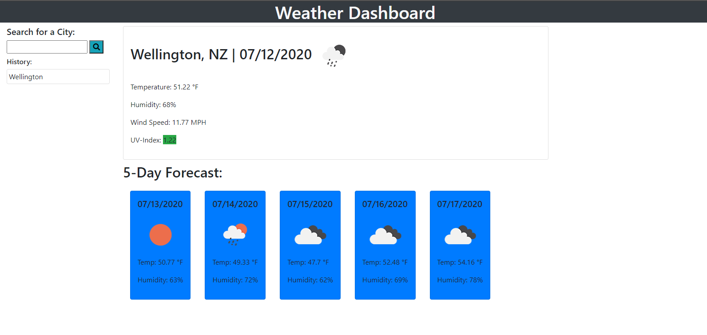

# weather-forecaster

## Description
This is a website made to let users search for the weather of any place, just type in your city or state. Since openWeather's oneCall request does not take a city name as a parameter, the first request on the site will be the forecast request using a city name. Once there is a response, using the data given, the city latitude and longitude is then passed onto the oneCall request.
## Screenshots

## Website Link
https://junioresc.github.io/weather-forecaster/